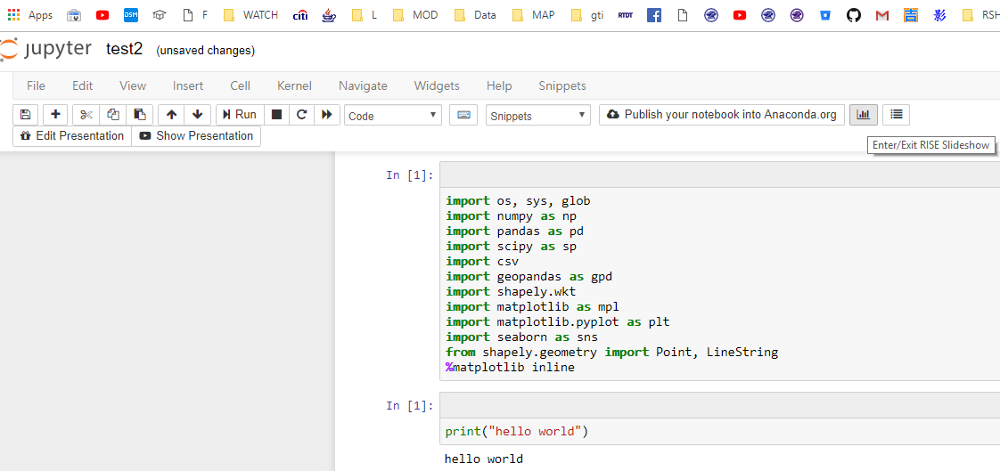

 [Yao-Jen Kuo](https://medium.com/@tonykuoyj) 在 Medium 上分享如何在 jupyter notebook環境下, 運用 nbconvert 將 .ipynb 輸出為適合簡報的投影片格式的文章([文章連結](https://medium.com/pyradise/jupyter-notebook-tricks-slideshows-a057a39c0a23))。內容摘要如下。


- [1. 播放模式](#1-%E6%92%AD%E6%94%BE%E6%A8%A1%E5%BC%8F)
- [2. 攜行模式](#2-%E6%94%9C%E8%A1%8C%E6%A8%A1%E5%BC%8F)
- [3. 輸出為 PDF](#3-%E8%BC%B8%E5%87%BA%E7%82%BA-pdf)
- [4. 在簡報時進行 Live Coding](#4-%E5%9C%A8%E7%B0%A1%E5%A0%B1%E6%99%82%E9%80%B2%E8%A1%8C-live-coding)
- [5. Slide 種類](#5-slide-%E7%A8%AE%E9%A1%9E)
- [6. 使用 nbc2slidesp.bat 簡化轉換流程](#6-%E4%BD%BF%E7%94%A8-nbc2slidespbat-%E7%B0%A1%E5%8C%96%E8%BD%89%E6%8F%9B%E6%B5%81%E7%A8%8B)
- [7. 延伸閱讀](#7-%E5%BB%B6%E4%BC%B8%E9%96%B1%E8%AE%80)


## 1. 播放模式
```
jupyter nbconvert my-nb-slide.ipynb --to slides --post serve
```


## 2. 攜行模式
* ### 將 reveal.js 下載至專案資料夾（透過 Git）
```
git clone https://github.com/hakimel/reveal.js.git
```
* ### 將專案資料夾中的 notebook 轉換為 HTML 投影片
```      
jupyter nbconvert my-nb-slide.ipynb --to slides --reveal-prefix reveal.js
```


## 3. 輸出為 PDF

啟動投影片模式簡報時將網址列
由 http://127.0.0.1:8000/my-nb-slide.slides.html#/   
改為 http://127.0.0.1:8000/my-nb-slide.slides.html?print-pdf   
就可以點選瀏覽器列印 (Ctrl + P)，另存為 PDF 文件。


## 4. 在簡報時進行 Live Coding
* ### 使用 conda 安裝 RISE 模組
```
conda install -c conda-forge rise
```   
完成 RISE 模組的安裝之後，重新啟動 Jupyter Notebook 將會在工具列看見一個新的按鈕（Enter/Exit RISE Slideshow），可用此鈕或是 key binding (Alt + R) 切換模式。

<!--  -->

<center>

</center>

## 5. Slide 種類
* -：不分頁的投影片
* Slide：水平移動的投影片（用作主題部分）
* Sub-Slide：垂直移動的投影片（用作隸屬於主題之下的內容部分）
* Fragment：在一張投影片中依序顯示多個儲存格
* Skip：輸出時略過該張投影片
* Notes：輸出時略過該張投影片並作為備忘錄講稿


## 6. 使用 nbc2slidesp.bat 簡化轉換流程
```{cmd}
IF NOT EXIST reveal.js (
  git clone https://github.com/hakimel/reveal.js.git
)
jupyter nbconvert %1 --to slides --reveal-prefix reveal.js
explorer %~n1.slides.html

pause
```

## 7. 延伸閱讀
* https://nbconvert.readthedocs.io/en/latest/index.html
* https://github.com/hakimel/reveal.js
* https://damianavila.github.io/RISE/